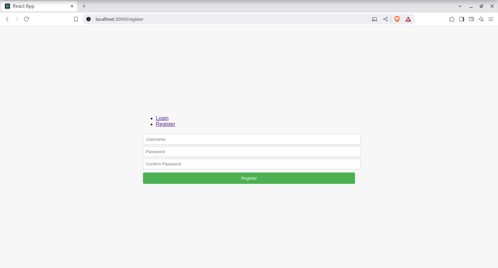
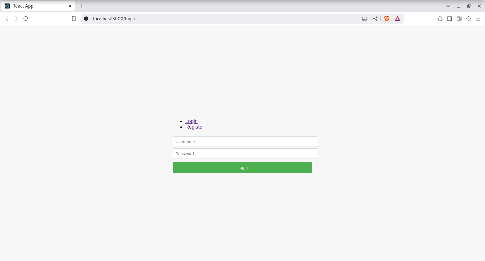

# 🔐 Login System with Docker

Este proyecto demuestra cómo gestionar un sistema de autenticación completo mediante **Docker**, dividiendo la arquitectura en tres servicios:

- 🖥️ **Frontend**: Interfaz de usuario para registro e inicio de sesión.
- ⚙️ **Backend**: API de autenticación (gestionado como microservicio).
- 🛢️ **Base de datos**: PostgreSQL como almacenamiento persistente.

La gestión de estos servicios se realiza de forma unificada con **Docker Compose**, permitiendo levantar todo el sistema con un solo comando.

---

## 🌐 Acceso desde el navegador

Una vez levantado el proyecto, puedes acceder a las siguientes rutas desde tu navegador:

- **Registro:** [http://localhost:3000/register](http://localhost:3000/register)  
  

- **Login:** [http://localhost:3000/login](http://localhost:3000/login)  
  

> Asegúrate de reemplazar las imágenes en la carpeta `images/` con capturas reales de tu proyecto.

---

## 🚀 ¿Cómo iniciar el sistema?

1. Clona el repositorio:

```bash
git clone https://github.com/tuusuario/login-system-docker.git
cd login-system-docker
```

2. Levanta los servicios con el siguiente comando:

```bash
docker-compose up --build
```
Este comando construirá y levantará los tres servicios: el frontend, el backend y la base de datos PostgreSQL.

3. Abre tu navegador y accede a:

- http://localhost:3000
